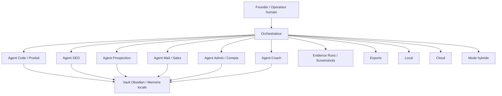

# Architecture

## Intention

L'architecture vise un MVP simple : un orchestrateur pilote des agents specialises, un vault local conserve la memoire durable, et des sorties sont exportees vers des dossiers de preuve et de travail.

## Schema

## Composants

### Orchestrateur

Role : recevoir une demande, router vers les bons agents, appliquer la politique de permissions, demander validation humaine si necessaire et journaliser les preuves attendues.

### Agents obligatoires

- Code / Produit : analyse besoin, spec rapide, structure de livraison
- SEO : audit initial, priorisation, recommandations locales
- Prospection : qualification lead, scoring, enrichment prudent
- Mail / Sales : emails, relances, syntheses, proposition commerciale
- Admin / Compta : devis, suivi statut, rappels administratifs
- Coach : priorisation du travail founder, hygiene operationnelle, suivi des blocages

### Memoire

Le `vault/` joue le role d'Obsidian / base de connaissance locale :

- fiches clients
- notes projet
- SOP et checklists
- historique decisionnel

### Plateformes possibles

- Local : documents, vault, scripts, stockage de preuves
- Cloud : LLM, email, CRM, enrichissement, automatisations externes
- Mixte : memoire locale + execution/modeles cloud

## Choix d'architecture

Ce design est volontairement simple. Le besoin reel n'est pas de batir une plateforme complexe day 1, mais de rendre visibles les roles, les flux, les limites et les points de controle humain.
